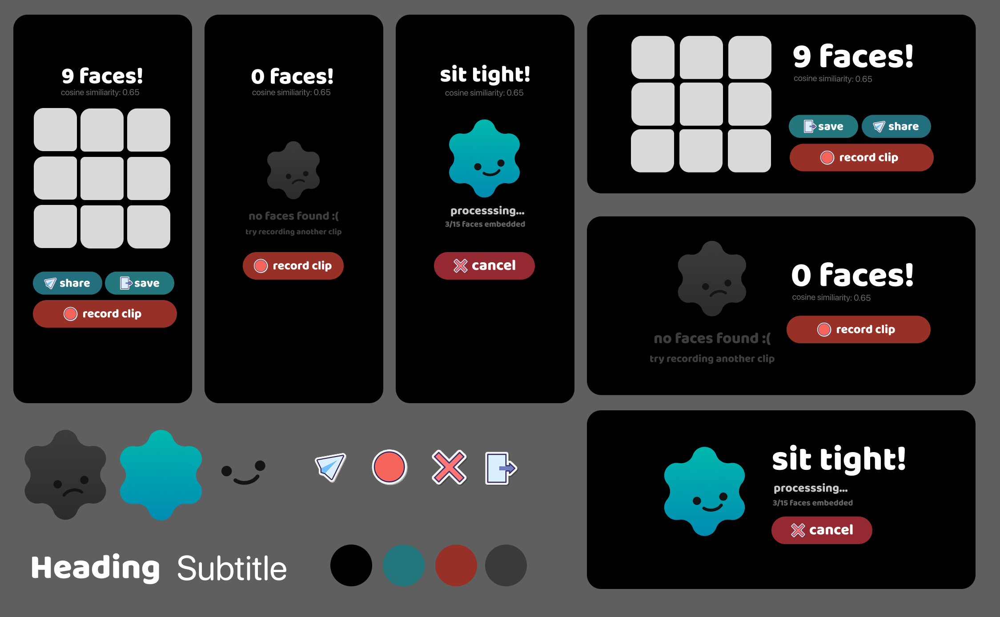
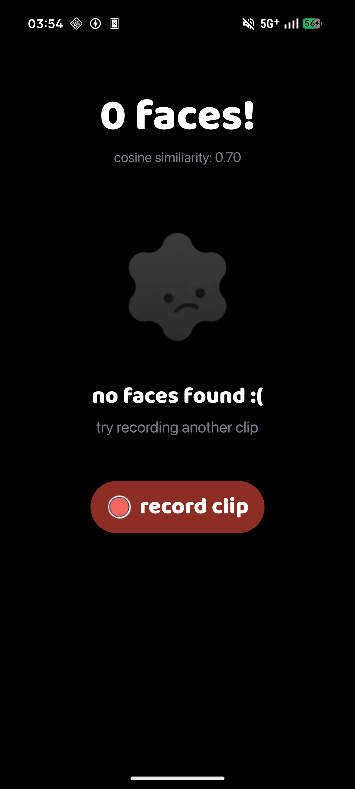
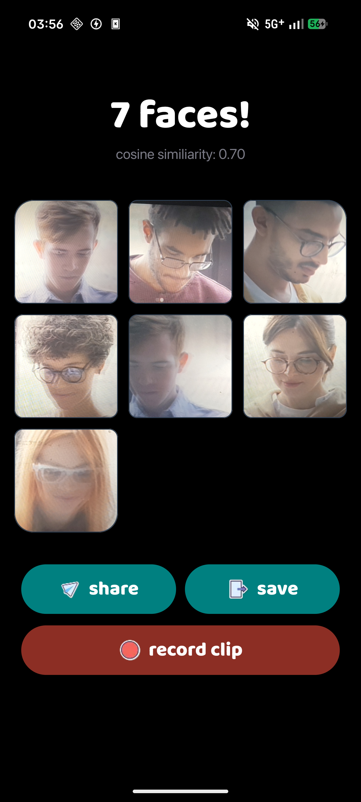
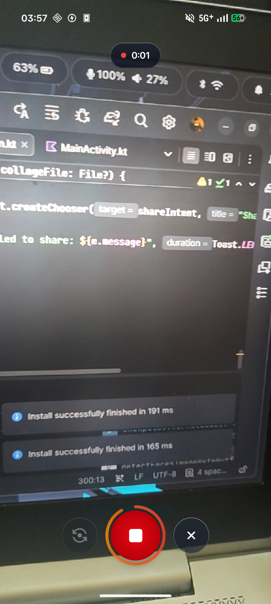
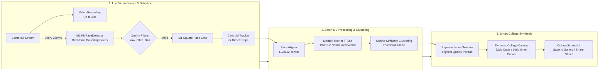

# IYKYK - Task 0



The app records clips up to 20 seconds, tracks unique human faces in real time, filters blur and head pose angles, computes deep feature embeddings, clusters unique individuals, and renders a rounded face collage.

---

## App Previews


<table>
  <tr>
    <td width="33.33%" align="center">
      
    </td>
    <td width="33.33%" align="center">
      
    </td>
    <td width="33.33%" align="center">
      
    </td>
  </tr>
</table>

---

## Architecture Overview

The application is structured into two processing stages:
1. **Real-Time Detection & Tracking**: Runs during live video recording at 250ms sampling intervals, maintaining temporal identity tracks using centroid proximity without burdening the UI thread.
2. **Batch ML Processing & Identity Clustering**: Runs post-recording in the background, computing face alignment, MobileFaceNet embeddings, cosine clustering, and high-resolution collage rendering.

---

## ML Diagrams



---

## Installation & How to Run

### Prerequisites
* **Android Studio**: Ladybug (2024.2.1) or newer
* **Java Development Kit (JDK)**: JDK 17 or JDK 21 (configured via `JAVA_HOME`)
* **Android SDK**:
  * `compileSdk`: 37
  * `minSdk`: 31 (Android 12+)
  * `targetSdk`: 37
* **Physical Device or Android Emulator**: API 31+ with camera support

### 1. Clone the Repository
```bash
git clone <repository-url>
cd iykyk-task0
```

### 2. Configure SDK Location
Create or verify `local.properties` in the project root:
```properties
sdk.dir=/path/to/your/Android/Sdk
```

### 3. Build via Command Line
Build the debug APK using the Gradle wrapper:
```bash
# Set your JDK path (example from Android Studio embedded JBR)
export JAVA_HOME=/opt/android-studio/jbr

# Clean and compile debug APK
./gradlew assembleDebug
```

The compiled APK will be located at:
```
app/build/outputs/apk/debug/app-debug.apk
```

### 4. Install & Launch on Device
Ensure your device or emulator is connected (`adb devices`):
```bash
# Install the APK
adb install -r app/build/outputs/apk/debug/app-debug.apk

# Launch the application
adb shell am start -n com.iykyk.task0/.MainActivity
```

---

## How to Configure the ML Pipeline

The entire machine learning and face processing pipeline is centralized in:
`app/src/main/java/com/iykyk/task0/ml/config/MLPipelineConfig.kt`

You can toggle filters on or off and calibrate algorithmic thresholds directly in this file:

### Feature Toggles

| Parameter | Type | Default | Description |
| :--- | :--- | :--- | :--- |
| `enableClustering` | `Boolean` | `true` | When `true`, clusters face embeddings by identity. When `false`, returns all unique tracked face samples directly. |
| `enableFaceAlignment` | `Boolean` | `true` | Rotates and aligns facial landmarks horizontally before feeding into the embedding model. |
| `enableFrontalityFilter` | `Boolean` | `true` | Discards extreme profile / turned-away faces to avoid unrepresentative embeddings. |
| `enableBlurFilter` | `Boolean` | `true` | Discards blurry frames evaluated via Laplacian variance. |
| `enableSharpnessFilter` | `Boolean` | `true` | Evaluates Sobel edge gradients to score and filter frame sharpness. |
| `enableSizeFilter` | `Boolean` | `false` | Filters out faces smaller than `minFaceSize` (in pixels). |

### Threshold Tuning

| Parameter | Type | Default | Tuning Guide |
| :--- | :--- | :--- | :--- |
| `similarityThreshold` | `Float` | `0.70f` | **Cosine Similarity Threshold**: Increasing (e.g. `0.75f`-`0.80f`) makes identity grouping stricter (distinguishing lookalikes). Decreasing (e.g. `0.60f`-`0.65f`) merges variations of the same person under harsh lighting. |
| `maxYaw` | `Float` | `45f` | Maximum allowed horizontal head turn angle (degrees) from frontal camera perspective. |
| `maxPitch` | `Float` | `35f` | Maximum allowed vertical head tilt angle (degrees) up or down. |
| `maxRoll` | `Float` | `35f` | Maximum allowed head roll angle (degrees) sideways. |
| `minBlurScore` | `Float` | `25f` | Minimum Laplacian variance score required for a frame to pass quality gates. |
| `minSharpness` | `Float` | `600f` | Minimum Sobel gradient magnitude required for a portrait crop. |
| `targetFrameIntervalMs` | `Long` | `250L` | Sampling frequency for real-time analysis (250ms = 4 FPS), balancing battery efficiency and temporal tracking density. |
| `trackingCentroidThreshold` | `Float` | `120f` | Maximum Euclidean distance (in pixels) to associate a detected face in the current frame with an existing track. |

### Example Custom Configuration
To use stricter clustering with relaxed yaw constraints, modify `MLPipelineConfig.kt`:
```kotlin
data class MLPipelineConfig(
    val enableFrontalityFilter: Boolean = true,
    val maxYaw: Float = 55f,               // Allow more side profiles
    val similarityThreshold: Float = 0.75f, // Stricter identity matching
    ...
)
```

---

## Key Project Structure

```
app/src/main/
├── assets/
│   ├── mobilefacenet.tflite          # TFLite MobileFaceNet model file
│   └── smile.svg                     # Vector asset for splash & app branding
├── java/com/iykyk/task0/
│   ├── MainActivity.kt               # Entry point and screen navigation router
│   ├── screens/
│   │   ├── CameraScreen.kt           # Real-time CameraX recording & face analysis
│   │   ├── ProcessingScreen.kt       # Background ML calculation progress screen
│   │   ├── CollageScreen.kt          # Final face grid presentation & sharing
│   │   └── PermissionScreen.kt       # Camera access prompt & settings redirection
│   ├── ui/components/
│   │   ├── FaceCollageGrid.kt        # Dynamic grid with 22dp outer / 10dp inner corner curves
│   │   ├── CollageHeader.kt          # Scalable screen header with tight font metrics
│   │   ├── CollageActionButtons.kt   # Dual-mode (portrait/landscape) action button cluster
│   │   ├── PillButton.kt             # Reusable capsule pill button
│   │   ├── CircularTimerRecordButton.kt # Sweeping gradient countdown ring record button
│   │   ├── ProcessingLoaderCard.kt   # Animated loader character with smile
│   │   └── NoFacesCard.kt            # 0 faces empty state card
│   ├── ml/
│   │   ├── config/MLPipelineConfig.kt# Centralized ML configuration & thresholds
│   │   ├── detection/                # ML Kit face detection & quality filters
│   │   ├── embedding/                # TFLite inference & face alignment
│   │   ├── clustering/               # Cosine distance clustering & prototype selector
│   │   └── processing/               # Real-time Detector & batch Processor
│   └── utils/
│       ├── CollageGenerator.kt       # High-res canvas collage export
│       ├── VideoRecorder.kt          # CameraX video recording coordinator
│       └── PermissionUtils.kt        # SharedPreferences permission denial & lifecycle helper
└── res/
    ├── drawable/                     # Icons, vectors, and shape definitions
    ├── mipmap-*/                     # Multi-density adaptive & round launcher icons
    └── values/themes.xml             # Android 12+ system splash screen configuration
```
