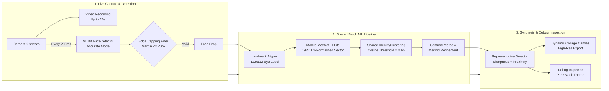

# IYKYK - Task 0

The app records clips up to 20 seconds, tracks unique human faces in real time, filters edge-clipped faces, computes deep feature embeddings, clusters unique individuals using cosine distance, and renders a rounded face collage.

---

## App Previews

<table>
  <tr>
    <td width="33.33%" align="center">
      
      <br/><b>Empty State (0 Faces)</b>
    </td>
    <td width="33.33%" align="center">
      
      <br/><b>Collage Output (Clustered Identities)</b>
    </td>
    <td width="33.33%" align="center">
      
      <br/><b>Camera Recording Screen</b>
    </td>
  </tr>
</table>

---

## Design Reference (Figma)


---

## Architecture Overview

The system operates across two coordinated pipelines sharing a unified ML clustering engine:
1. **Live Capture & Real-Time Detection**: Records 16:9 video synchronized with physical display orientation, samples frames every 250ms, detects faces using ML Kit Face Detection, applies a 20px edge clipping boundary filter, and tracks face samples.
2. **Batch ML Processing & Identity Clustering**: Runs post-recording in the background. Faces are aligned horizontally using eye landmarks (112x112), embedded into 192D L2-normalized vectors via MobileFaceNet TFLite, clustered using the shared `IdentityClustering` engine at cosine threshold `0.65`, evaluated for representative portraits, and rendered into a collage.
3. **In-App Pure Black Debug Inspector**: Provides an end-to-end visual breakdown of sampled frames, edge clipping evaluation, preprocessed cuts, clustering assignments, and synthesized collage outputs.

---

## ML Pipeline Flow



---

## Installation & Running

### Prerequisites
* **Android Studio**: Ladybug (2024.2.1) or newer
* **JDK**: JDK 17 or JDK 21 (via `JAVA_HOME`)
* **Android SDK**:
  * `compileSdk`: 37
  * `minSdk`: 31 (Android 12+)
  * `targetSdk`: 37
* **Device**: Physical device or emulator (API 31+)

### Build via Command Line
```bash
export JAVA_HOME=/opt/android-studio/jbr
./gradlew assembleDebug
```

The APK is produced at:
```
app/build/outputs/apk/debug/app-debug.apk
```

### Install and Launch
```bash
adb install -r app/build/outputs/apk/debug/app-debug.apk
adb shell am start -n com.iykyk.task0/.MainActivity
```

---

## ML Pipeline Configuration

The ML pipeline settings are centralized in:
`app/src/main/java/com/iykyk/task0/ml/config/MLPipelineConfig.kt`

### Feature Toggles

| Parameter | Type | Default | Description |
| :--- | :--- | :--- | :--- |
| `enableClustering` | `Boolean` | `true` | When true, groups embeddings into unique identities using cosine similarity. |
| `enableFaceAlignment` | `Boolean` | `true` | Rotates face to align eye landmarks horizontally at 112x112 resolution. |
| `enableEdgeClippingFilter` | `Boolean` | `true` | Validates face boundaries, rejecting faces within 20px of any frame border. |
| `enableFrontalityFilter` | `Boolean` | `false` | When enabled, discards extreme head angles. |
| `enableBlurFilter` | `Boolean` | `false` | When enabled, evaluates Laplacian variance against blur threshold. |
| `enableSharpnessFilter` | `Boolean` | `false` | When enabled, filters crops via Sobel edge gradient scoring. |
| `enableSizeFilter` | `Boolean` | `false` | Filters out faces smaller than `minFaceSize`. |
| `enableTracking` | `Boolean` | `false` | Centroid-based temporal tracker across consecutive frames. |

### Threshold Parameters

| Parameter | Type | Default | Description |
| :--- | :--- | :--- | :--- |
| `similarityThreshold` | `Float` | `0.65f` | Cosine similarity threshold for identity grouping. |
| `edgeClippingMarginPx` | `Int` | `20` | Edge clipping margin: rejects face if within 20px of frame border. |
| `embeddingDimension` | `Int` | `192` | Output vector size produced by MobileFaceNet. |
| `targetFrameIntervalMs` | `Long` | `250L` | Real-time analysis frame sampling interval (4 FPS). |

---

## Project Structure

```
app/src/main/
├── assets/
│   ├── mobilefacenet.tflite          # MobileFaceNet model file
│   └── smile.svg                     # Vector asset for splash & branding
├── java/com/iykyk/task0/
│   ├── MainActivity.kt               # Entry point and screen navigation router
│   ├── screens/
│   │   ├── CameraScreen.kt           # Real-time CameraX recording & face analysis
│   │   ├── ProcessingScreen.kt       # Background ML calculation progress screen
│   │   ├── CollageScreen.kt          # Final face grid presentation & sharing
│   │   └── PermissionScreen.kt       # Camera access prompt & settings redirection
│   ├── ui/components/
│   │   ├── FaceCollageGrid.kt        # Dynamic grid layout with rounded curves
│   │   ├── CollageHeader.kt          # Scalable header typography
│   │   ├── CollageActionButtons.kt   # Portrait & landscape action button layout
│   │   ├── CircularTimerRecordButton.kt # Sweeping gradient countdown record ring
│   │   ├── ProcessingLoaderCard.kt   # Animated loader character
│   │   └── NoFacesCard.kt            # Empty state card
│   ├── ml/
│   │   ├── config/MLPipelineConfig.kt# Centralized ML configuration & thresholds
│   │   ├── detection/                # ML Kit face detection & quality filters
│   │   ├── quality/                  # EdgeClippingValidator and image quality validators
│   │   ├── embedding/                # TFLite inference & face alignment
│   │   ├── clustering/               # Shared IdentityClustering & EmbeddingMath
│   │   └── processing/               # Real-time Detector & batch Processor
│   ├── debug/
│   │   ├── DebugScreen.kt            # Pure black theme pipeline inspector UI
│   │   ├── DebugSessionHolder.kt     # Live session holder bridging camera to debug view
│   │   └── ml/                       # Debug pipeline runner, collage maker, and exporter
│   └── utils/
│       ├── CollageGenerator.kt       # High-res canvas collage export
│       └── VideoRecorder.kt          # CameraX video recording coordinator
└── res/
    ├── drawable/                     # Icons, vectors, and shape definitions
    ├── mipmap-*/                     # Multi-density launcher icons
    └── values/themes.xml             # System splash screen configuration
```
